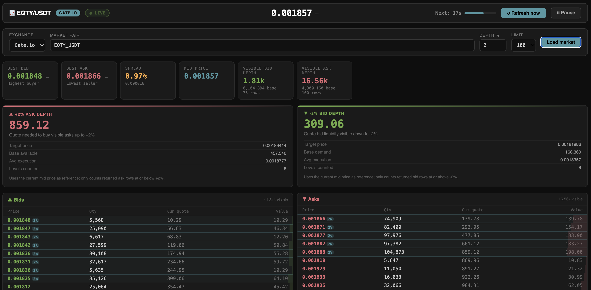

# Crypto Orderbook Depth Template

A reusable static dashboard template for checking **orderbook depth around the current mid price** on crypto exchanges.

The default setup is designed for:

```text
Exchange: Gate.io
Pair:     EQTY_USDT
Depth:    +2% ask depth / -2% bid depth
Refresh:  30 seconds
```

The project can also monitor other public spot pairs and exchanges by changing GitHub repository variables, URL query parameters, or the frontend selector.

---

## What the dashboard shows

The main purpose is to answer:

```text
How much liquidity is available within +X% / -X% of the current mid price?
```

It shows:

- Best bid
- Best ask
- Spread
- Mid price
- Visible bid depth
- Visible ask depth
- +X% ask depth
- -X% bid depth
- Full visible orderbook rows
- Highlighting of rows inside the configured depth range

---

## Architecture

```text
GitHub Pages frontend
        ↓
Cloudflare Worker proxy
        ↓
Exchange public orderbook API
```

The Cloudflare Worker is used because browsers often cannot read exchange APIs directly due to CORS restrictions.

The frontend is static and public. It does not contain exchange API keys or private account data.

---

## Supported exchanges

The Worker currently supports normalized orderbook fetching from:

| Exchange | Example pair format |
|---|---|
| Gate.io | `EQTY_USDT` |
| KuCoin | `EQTY-USDT` |
| Binance | `BTCUSDT` |

Examples:

```text
/orderbook?exchange=gate&pair=EQTY_USDT&limit=100
/orderbook?exchange=kucoin&pair=BTC-USDT&limit=100
/orderbook?exchange=binance&pair=BTCUSDT&limit=100
```

The frontend also supports sharable URLs:

```text
https://YOURUSER.github.io/YOURREPO/?exchange=gate&pair=EQTY_USDT
https://YOURUSER.github.io/YOURREPO/?exchange=kucoin&pair=BTC-USDT
https://YOURUSER.github.io/YOURREPO/?exchange=binance&pair=BTCUSDT
```

---

## Files

```text
index.html                         Main static page
app.js                             Frontend dashboard logic
style.css                          Dashboard styling
config.example.js                  Example local frontend config
config.js                          Local frontend config fallback
worker.js                          Cloudflare Worker proxy
wrangler.toml                      Worker deployment config
site.webmanifest                   Basic web app manifest
.github/workflows/deploy-pages.yml GitHub Pages deployment
.github/workflows/deploy-worker.yml Optional Worker deployment
README.md                          Documentation
```

---

## GitHub Variables vs Secrets

Use **GitHub Variables** for public frontend settings:

```text
SITE_TITLE
DEFAULT_EXCHANGE
DEFAULT_PAIR
WORKER_URL
REFRESH_SECONDS
DEPTH_PERCENT
DEFAULT_LIMIT
ALLOW_USER_PAIR
PIN_DEFAULT_PAIR
```

These values are not secret. They are written into the public `config.js` file during GitHub Pages deployment.

Use **GitHub Secrets** only if you want GitHub Actions to deploy your Cloudflare Worker:

```text
CLOUDFLARE_API_TOKEN
CLOUDFLARE_ACCOUNT_ID
```

Cloudflare secrets are optional. You do not need them if you deploy the Worker manually in Cloudflare, use Cloudflare Git integration, or use an existing Worker URL.

---

## Minimal setup

### 1. Create a repo from this template

Use GitHub's **Use this template** button, or clone it manually.

### 2. Create or deploy a Cloudflare Worker

You can deploy `worker.js` in any of these ways:

- Cloudflare Dashboard code editor
- Cloudflare Git integration
- Local `npx wrangler deploy`
- Optional GitHub Actions workflow in this repo

After deployment, you should have a Worker URL such as:

```text
https://your-worker.your-subdomain.workers.dev
```

Test it:

```bash
curl "https://your-worker.your-subdomain.workers.dev/orderbook?exchange=gate&pair=EQTY_USDT&limit=20"
```

You should see JSON with `bids` and `asks`.

### 3. Set GitHub repository variables

Go to:

```text
Repo → Settings → Secrets and variables → Actions → Variables
```

Recommended starting values:

```text
SITE_TITLE       EQTY/USDT Orderbook Depth
DEFAULT_EXCHANGE gate
DEFAULT_PAIR     EQTY_USDT
WORKER_URL       https://your-worker.your-subdomain.workers.dev
REFRESH_SECONDS  30
DEPTH_PERCENT    2
DEFAULT_LIMIT    100
ALLOW_USER_PAIR  true
PIN_DEFAULT_PAIR true
```

### 4. Enable GitHub Pages

Go to:

```text
Repo → Settings → Pages
```

Use GitHub Actions as the Pages source. The included workflow deploys the static site from the generated `dist` directory.

### 5. Push to `main`

```bash
git add .
git commit -m "Initial orderbook depth template setup"
git push
```

The site will deploy to:

```text
https://YOURUSER.github.io/YOURREPO/
```

---

## Optional Worker deployment through GitHub Actions

This is optional.

If you want GitHub Actions to deploy the Cloudflare Worker, add these repository secrets:

```text
CLOUDFLARE_API_TOKEN
CLOUDFLARE_ACCOUNT_ID
```

Then run:

```text
Actions → Optional Cloudflare Worker Deploy → Run workflow → deploy=true
```

If you do not set those secrets, the frontend still works as long as `WORKER_URL` points to a Worker you deployed another way.

---

## Local development

Clone the repo:

```bash
git clone https://github.com/YOURUSER/YOURREPO.git
cd YOURREPO
```

Copy the example config:

```bash
cp config.example.js config.js
```

Edit `config.js`:

```js
window.ORDERBOOK_CONFIG = {
  siteTitle: "EQTY/USDT Orderbook Depth",
  defaultExchange: "gate",
  defaultPair: "EQTY_USDT",
  workerUrl: "https://your-worker.your-subdomain.workers.dev",
  refreshSeconds: 30,
  depthPercent: 2,
  defaultLimit: 100,
  allowUserPair: true,
  pinDefaultPair: true
};
```

Serve locally:

```bash
python3 -m http.server 8080
```

Open:

```text
http://localhost:8080/
```

---

## Worker configuration

The Worker has public environment variables in `wrangler.toml`:

```toml
[vars]
DEFAULT_EXCHANGE = "gate"
DEFAULT_PAIR = "EQTY_USDT"
ALLOWED_ORIGINS = "*"
ALLOW_DIRECT = "true"
KUCOIN_PROXY_URL = ""
```

For production, consider restricting origins:

```toml
ALLOWED_ORIGINS = "https://YOURUSER.github.io,http://localhost:8080"
```

This blocks browser JavaScript from unknown origins before the Worker fetches exchange data.

CORS is not a complete anti-abuse mechanism. For stronger protection, use Cloudflare rate limiting, caching, WAF rules, or per-IP throttling.

---

## Optional Worker Variables

These variables are configured on the Cloudflare Worker side, either in `wrangler.toml` under `[vars]` or in the Cloudflare dashboard under **Worker → Settings → Variables and Secrets**.

| Variable | Required | Default | Description |
|---|---:|---|---|
| `ALLOWED_ORIGINS` | Recommended | `*` | Comma-separated list of browser origins allowed to call the Worker. Example: `https://example.com,https://owner.github.io` |
| `ALLOW_DIRECT` | Optional | `true` | Allows direct non-browser requests such as `curl`, which usually have no `Origin` header. |
| `DEFAULT_EXCHANGE` | Optional | `gate` | Default exchange used by the Worker if no exchange is supplied. |
| `DEFAULT_PAIR` | Optional | `EQTY_USDT` | Default pair used by the Worker if no pair is supplied. |
| `KUCOIN_PROXY_URL` | Optional | empty | Optional external proxy for KuCoin requests. Use this when KuCoin rate-limits Cloudflare Worker egress IPs. |

---

## Security notes

This project is read-only by default.

It does not include:

- Exchange API keys
- Trading credentials
- Wallet private keys
- Passwords
- Private account data
- Order creation logic
- Order cancellation logic

Public frontend configuration is visible to everyone. Do not put secrets in `config.js`, GitHub Variables used by the frontend, or the HTML.

Secrets should only be used for deployment credentials, and only in server-side contexts such as GitHub Actions or Cloudflare Worker settings.

---

## Query parameters

The frontend accepts URL parameters:

```text
?exchange=gate&pair=EQTY_USDT
?exchange=kucoin&pair=BTC-USDT
?exchange=binance&pair=BTCUSDT
```

If no URL parameters are present, the dashboard uses the configured defaults.

---

## Exchange Support

| Exchange | Status | Notes |
|---|---|---|
| Gate.io | Stable | Works directly through the Cloudflare Worker. |
| Binance | Stable | Uses Binance public market-data fallback endpoints. |
| KuCoin | Best effort | Direct mode may be rate-limited by KuCoin. For reliable support, deploy the included `kucoin-proxy/` service and set `KUCOIN_PROXY_URL`. |

---

## Optional KuCoin Render Proxy

KuCoin may rate-limit shared Cloudflare Worker egress IPs. If this happens, KuCoin requests through the default Cloudflare Worker can fail with errors like:

```json
{
  "code": "429000",
  "msg": "Too many requests. User-level rate limit exceeded."
}
```

This template includes an optional KuCoin proxy in:

```text
kucoin-proxy/
```

The proxy exposes:

```text
GET /health
GET /orderbook?pair=BTC-USDT&limit=20
GET /markets
```

Deploy with Render Blueprint

The repo includes a root-level render.yaml.

In Render:

```text
New → Blueprint → connect this repo → deploy
```

Render will deploy the kucoin-proxy/ folder as a Node web service.

Deploy manually as a Render Web Service

Use these settings:

```text
Root Directory: kucoin-proxy
Region:         Frankfurt
Build Command:  npm install
Start Command:  npm start
```

After deployment, Render gives you a URL like:

```text
https://your-kucoin-proxy.onrender.com
```

Add that URL to your Cloudflare Worker config (or in wrangler.toml):

```text
KUCOIN_PROXY_URL=https://your-kucoin-proxy.onrender.com
```

The frontend still calls the main Cloudflare Worker. The Worker decides whether KuCoin requests go directly to KuCoin or through the optional Render proxy.

---

## License

MIT
